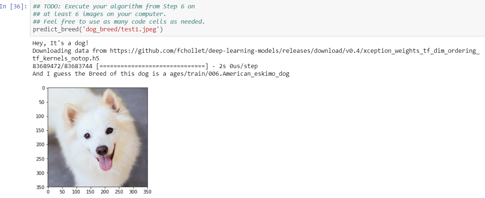
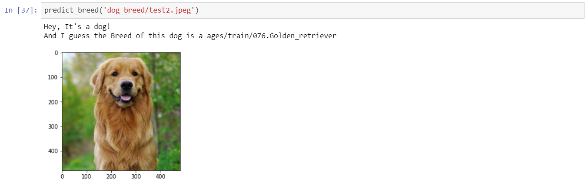
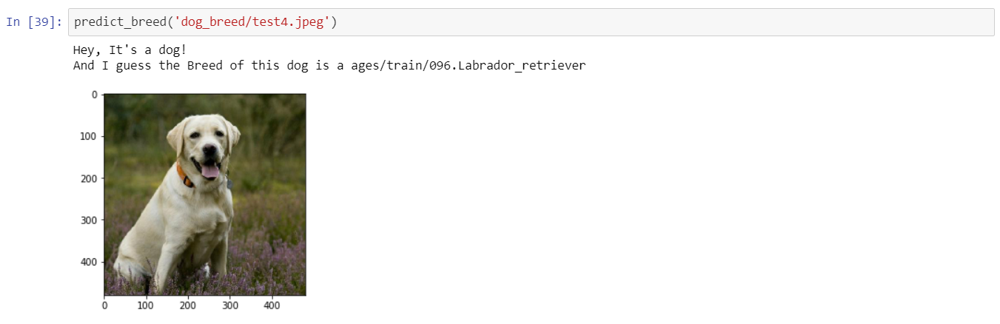
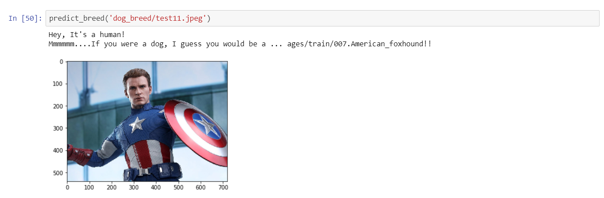
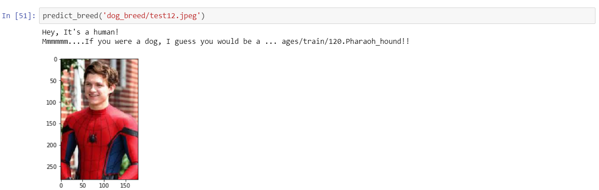

# dog_breed_classifer

### Table of content
1. [Description](#description)
2. [Requirements](#requirements)
3. [Library](#library)
4. [Output](#output)
5. [Conclusion](#conclusion)
6. [Acknowledgement](#acknowledgement)

## Description
Dog breed classifer is Udacity Data Science Nanodegree Project which invloves Opencv,tensorflow. Which bases on Convolutional Neural Networks.It's Great learning experience with Udacity.This app identify dog breed of input images and if input is human face model suggest dog breed.
Kindly refer my python notebook for all the steps of This project

## Requirements
* Python 3.6
* Machine Learning Libraries : OpenCV, Tensorflow

## Library

#### OpenCV 

OpenCV (Open Source Computer Vision Library) is an open source computer vision and machine learning software library. OpenCV was built to provide a common infrastructure for computer vision applications and to accelerate the use of machine perception in the commercial products. Being a BSD-licensed product, OpenCV makes it easy for businesses to utilize and modify the code.

#### Tensorflow

TensorFlow is an end-to-end open source platform for machine learning. It has a comprehensive, flexible ecosystem of tools, libraries, and community resources that lets researchers push the state-of-the-art in ML and developers easily build and deploy ML-powered applications.

TensorFlow was originally developed by researchers and engineers working on the Google Brain team within Google's Machine Intelligence Research organization to conduct machine learning and deep neural networks research. The system is general enough to be applicable in a wide variety of other domains, as well.

## Output
Let's See some output of dogs 

some interesting output

## Conclusion
At the start, my objective was to create a CNN with more than 60% testing accuracy under 2 mins of training on GPU. Our final model obtained more than 70% testing accuracy under the training of 20 secs.
There are still very high chances to increase model accuracy with the following techniques:
Image Augmentation, Increasing Dense layers and Increasing no of epochs with Dropout to decrease the chances of model overfitting.
Following the above areas, I’m sure we could increase the testing accuracy of the model to above 95%.

## Acknowledgement

Udacity

## blog link 
https://medium.com/@pratikmpatil12/dog-breed-classifier-udacity-capstone-project-24c26a0a4f89
